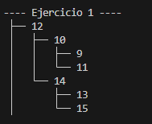
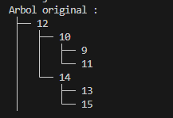
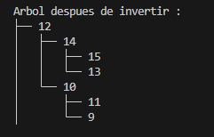
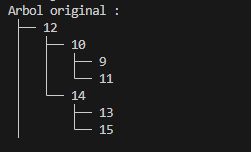
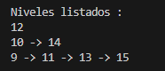
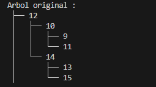

# Ejercicios de Estructuras No lineales

## 📌 Información General

- **Título:** Estructuras No lineales
- **Asignatura:** Estructura de Datos
- **Carrera:** Computación
- **Estudiante:** Kevin Paladines
- **Fecha:** 06/07/2025
- **Profesor:** Ing. Pablo Torres

---

## 🧩 Estructura del proyecto
    src/
    │
    ├── Main
    │   └── Ejercicio_01_insert
    │       └── InsertBST
    │   └── Ejercicio_02_invert
    │       └── InvertBinaryTree
    │   └── Ejercicio_03_listLevels
    │       └── listLevels
    │   └── Ejercicio_04_depth
    │       └── Depth
    │
    │   └── Materia
    │       └── Controllers
    │           └── ArbolBinario
    │           └── ArbolRecoridos
    │           └── AVLTree
    │       └── Models
    │           └── 
    │
    │   └── App
    │
    ├── Test
    │   └── Ejercicio_01_insert
    │       └── InsertBSTTest
    │   └── Ejercicio_02_invert
    │       └── InvertBinaryTreeTest
    │   └── Ejercicio_03_listLevels
    │       └── listLevelsTest
    │   └── Ejercicio_04_depth
    │       └── DepthTest


    ---

---

# Estructuras No Lineales – Ejercicios Árboles

Este proyecto contiene la solución a cuatro ejercicios prácticos sobre estructuras de datos tipo árbol binario, como parte del aprendizaje de estructuras no lineales en Java. Cada ejercicio se encuentra organizado en su propia carpeta, siguiendo la convención de paquetes y buenas prácticas.

---

## Identificación del Estudiante (Obligatorio)

Antes de comenzar a programar o ejecutar el proyecto, **debes completar tu nombre y correo institucional en el archivo `student.env`** que se encuentra en la raíz del proyecto. Este archivo es necesario para validar tu identidad como autor del trabajo.

### ¿Por qué es obligatorio?

Este proyecto utiliza una verificación automática que valida que has ingresado tu información personal. Si no lo haces:

- Al ejecutar el proyecto (`App.java`) verás este mensaje de error:
```
❌ Debes completar STUDENT_NAME y STUDENT_EMAIL en student.env
```
- No podrás enviar tu código (`push`) al repositorio si tienes activado el sistema de validación local.
- Las pruebas automáticas en GitHub Actions también fallarán si no detectan tu nombre y correo.

## Descripción de Ejercicios

### Ejercicio 01: Insertar en un Árbol Binario de Búsqueda (BST)

📂 Carpeta: `Ejercicio_01_insert`
En este ejercicio se implementa una clase llamada InsertBST que contiene el método insert, el cual permite construir un Árbol Binario a partir de una lista de valores enteros. El objetivo es insertar cada número en la posición correspondiente del árbol.

 **Input propuesto:** `[12, 10, 14, 9, 11, 13, 15]`

 **Arbol esperado:**


---

### Ejercicio 02: Invertir un Árbol Binario

📂 Carpeta: `Ejercicio_02_invert`
Este ejercicio implementa un método que invierte un Árbol Binario, es decir, intercambia los subárboles izquierdo y derecho de todos los nodos del árbol. En este ejercicio se utiliza recursión.

 **Arbol original:**



**Arbol invertido:**



---

### Ejercicio 03: Listar Niveles en Listas Enlazadas

📂 Carpeta: `Ejercicio_03_listLeves`
Este ejercicio implementa un método que recorre un árbol binario nivel por nivel y agrupa los nodos de cada nivel en una lista independiente. El resultado final es una lista general que contiene una sublista por cada nivel del árbol.

 **Arbol original:**



**Niveles listados:**



---

### Ejercicio 04: Calcular la Profundidad Máxima

📂 Carpeta: `Ejercicio_04_depth`
En este ejercicio se implementa un algoritmo para calcular la profundidad máxima de un árbol binario, es decir, la longitud del camino más largo desde la raíz hasta una hoja.

 **Arbol original:**




**Output esperado:**


---

## Rúbrica de Calificación

| **Criterio**       | **Descripción**                                                                       | **Puntaje** |
| ------------------ | ------------------------------------------------------------------------------------- | ----------- |
| **Informe**        | No hay informe                                                                        | 0 pts       |
|                    | Informe parcial **sin explicación** de cada método                                    | 1 pt        |
|                    | Informe parcial **con explicación** de cada método                                    | 2 pts       |
|                    | Informe completo                                                                      | 3 pts       |
| **Funcionamiento** | No implementado                                                                       | 0 pts       |
|                    | Implementado parcialmente: <br>• Ejercicio 1 y 4 → 2 pts<br>• Ejercicio 2 y 3 → 4 pts | 2–4 pts     |
|                    | Código funcional pero **no pasa todas las pruebas**                                   | 6 pts       |
|                    | Código funcional y **pasa todas las pruebas correctamente**                           | 7 pts       |
